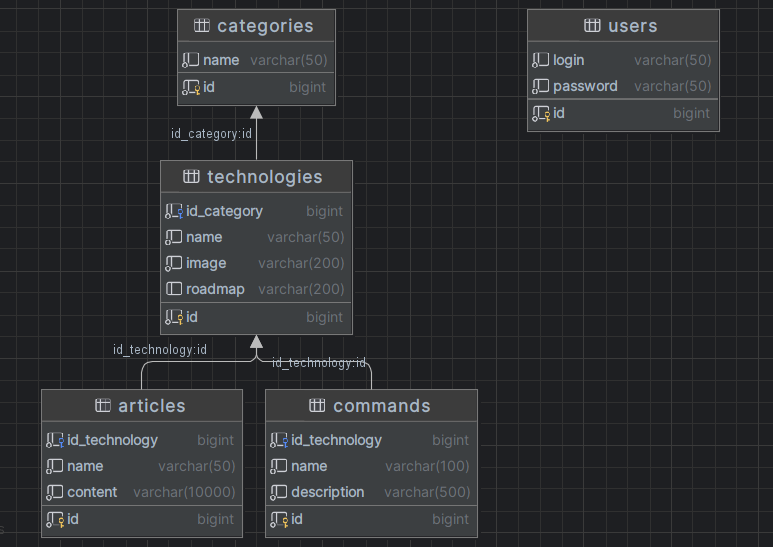

# Endpoint.sh Database

Base de donnée MySql pour stocker les données du projet. La base de données contient de la documentation informatique avec des articles sur des technologies ainsi que les principales commandes utiles de ces dernières.

## Informations

Le script SQL pour la création de la base de donnée se situe dans le dossier resources.

```
database : documentation
login : root
password : test
```

## UML

